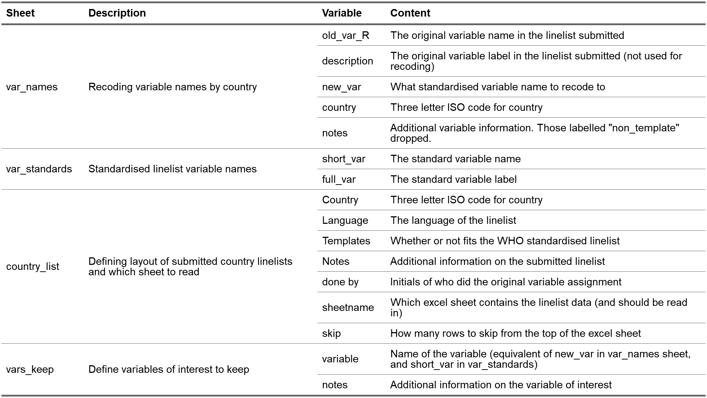
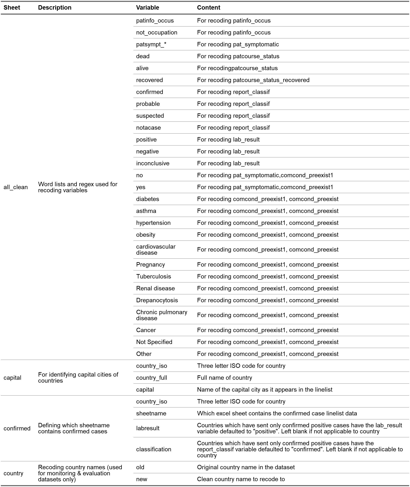
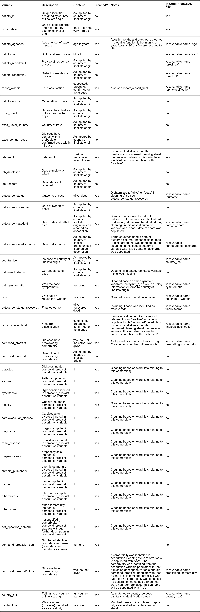

<!-- README.md is generated from README.Rmd. Please edit that file -->

# covidmonitor

<!-- badges: start -->
<!-- badges: end -->

The goal of {covidmonitor} is to provide functions for simplifying data
merging and cleaning for WHO AFRO COVID-19 linelists and monitoring &
evaluation data. The package further contains templates for automating
report production.

## Installation

Currently the package is not on CRAN. Once it is - you can install the
released version of epichecks from [CRAN](https://CRAN.R-project.org)
with:

``` r
# install.packages("covidmonitor")
```

In order to install the package you will first need to install an extra
bit of software called
[Rtools](https://cran.r-project.org/bin/windows/Rtools/).  
You can download the installer from:
<https://cran.r-project.org/bin/windows/Rtools/>  
Please install the version highlighted in green.

Once this is installed and you have restarted your computer, the
development version of the package can be installed from
[GitHub](https://github.com/) with:

``` r
# install.packages("remotes")
remotes::install_github("R4IDSR/covidmonitor")
```

If you do not have a LaTeX editor installed on your computer, then
please run the following code to install TinyTex. This is needed in
order to be able to create Word and PDF documents using *R markdown*.

``` r
install.packages('tinytex')
tinytex::install_tinytex()
# to uninstall TinyTeX, run tinytex::uninstall_tinytex() 
```

## Country linelists

### Folder structure

Functions and templates are set up to run based on files contained in
the AFRO WHE HIM - Country LineList sharepoint folder. This folder
contains all the latest country linelist files which are automatically
sorted from files emailed to
[afrooutbreak@who.int](afrooutbreak@who.int) by countries, using a .net
script.

To ensure that the data pipeline works in an automated fashion, please
always email the country files to the email address specified. This way
the latest file can be efficiently identified.

### File naming and format

In order for the *R* functions to run, the files must be named
appropriately, with the start of the file name containing the three
letter ISO code for the country followed by a dot (.) and then the date
of report; after this the rest of the name can be anything. For example
a file submitted by Namibia on the 29th of January 2021 should have
“NAM.2021-01-29” at the beginning of the name, and so the full file name
could be “NAM.2021-01-29.Linelist.Namibia COVID-19 Confirmed.xlsx”.

All files must be stored as an excel file (i.e. **xlsx**), those stored
as binary workbooks (**xlsb**) will throw an error and must be re-saved
as **xlsx**.

**n.b** some countries (e.g. TCD and SEN) have saved their date
variables in excel using the 1904 date system (i.e. date origin is 1st
January 1904 rather than 1900), this needs to be restructured manually
in the excel file otherwise the *R* function will produce dates that are
off by four years. See
[here](https://docs.microsoft.com/en-us/office/troubleshoot/excel/1900-and-1904-date-system)
for details. **Lines 484-486** can be uncommented in
**linelist\_clean.R** raw code to crudely deal with this issue but it is
recommened to fix the issue manually and not use this quick fix.

### Dictionaries

In order for the functions to work, several data dictionaries are
required. The first is called
[linelist\_dictionary.xlsx](https://github.com/R4IDSR/covidmonitor/raw/master/inst/extdata/linelist_dictionary.xlsx)
and contains information for defining and naming variables, as well as
defining which sheet to read in from the various country linelists. The
second is called
[cleaning\_dictionary.xlsx](https://github.com/R4IDSR/covidmonitor/raw/master/inst/extdata/cleaning_dictionary.xlsx)
and contains information for cleaning and recoding variables. Details of
the required sheet names and contents are in the table below.

The functions use default to using dictionaries which are pre-defined
within the package, however you can also edit these dictionaries by
downloading them from GitHub (links provided above), and then specifying
the file path within the function call (see help files for function
argument details). **N.b** sheet and variable names should not be
changed (otherwise the function will break).

### Outputs

2 **csv** files are outputed from the *R* functions which merge and
clean country linelists (functions called *merge\_linelist* and
*clean\_linelist*, respectively).

The first output file beginning with **Cleaned\_linelist\_** (default
outputname) contains 43 variables and all cases as merged and cleaned by
the *R* function

The second output begining with **ConfirmedCases\_** contains 19
variables with only cases that had a confirmed or probable final epi
classification. Variable names have been simplifed. This file or files
with the same format and variable names as this output should be used in
country linelist template (see **Templates** section).

Descriptions, content, cleaning and other information about the
variables in the output **csv** files are summarised in the tables
below:

**Table**: Required variables by sheet in the linelist dictionary.



**Table**: Required variables by sheet in the cleaning dictionary



**Table**: Description of variables in output files.



### Templates

There are two templates available for country linelist data. These are
similar, however one produces an HTML document (with more content) and
the other produces a powerpoint document.

#### HTML document

The first will produce a HTML output in the style of a report with
summary text, tables and figures of the daily situation of Covid-19 in
the WHO African region. The dataset beginning with **ConfirmedCases\_**
outputed from the merging and cleaning function should be used as the
data input in this template.

Select the template entitled “WHO daily Covid-19 report summary (HTML)”.
Change the date of report (dateofreport) and directory and filename of
the **ConfirmedCases\_** file you wish to use (inputdirectory) in the
parameters section (params:) at the top in the yaml header and then
knit. In order to access templates, follow the steps described in the
[epichecks
readme](https://github.com/R4IDSR/epichecks#who-afro-monthly-bulletin).

#### Powerpoint document

This is similar to the HTML document above, but has more tailored
content. To access it, select the template entitled “WHO daily Covid-19
report summary (PPT)”.

You will need to update the reference\_doc location in the YAML header
as well as the current week you are trying to run in the
“define\_current\_week” code chunk. In order to access templates, follow
the steps described in the [epichecks
readme](https://github.com/R4IDSR/epichecks#who-afro-monthly-bulletin).

## Monitoring & Evaluation

### Folder structure

Functions and templates are set up to run based on files contained in
the COVID-19 Outbreak Documentation &gt; KPI sharepoint folder. This
folder contains all the latest M&E files submitted organised in to
folders by the month, and sub-folders for the day within that month it
was submitted.

### File naming and format

File names must start with the three letter ISO code for the country
followed by “.KPI.”, afterwhich the rest of the file name can be
anything. All files must be in .xlsx format.

For example: A file submitted by Ghana on the 1st of September 2020
would be in the following folder:  
“COVID-19- Outbreak Documentation/KPI/**2020-09**/**09-01**”  
And would be called:  
“**GHA.KPI.** New weekly reporting template.xlsx”

### Dictionaries

In order for the functions to work, several data dictionaries are
required. The first is called
[mne\_dictionary.xlsx](https://github.com/R4IDSR/covidmonitor/raw/master/inst/extdata/mne_dictionary.xlsx)
and contains information for defining and naming variables, as well as
defining which sheet to read in from the various country linelists. The
second is called
[cleaning\_dictionary.xlsx](https://github.com/R4IDSR/covidmonitor/raw/master/inst/extdata/cleaning_dictionary.xlsx)
and contains information for cleaning and recoding country names (see
country sheet of the cleaning\_dict table above). Details of the
required sheet names and contents for mne\_dict are in the table below.

The functions use default to using dictionaries which are pre-defined
within the package, however you can also edit these dictionaries by
downloading them from GitHub (links provided above), and then specifying
the file path within the function call (see help files for function
argument details). **N.b** sheet and variable names should not be
changed (otherwise the function will break).

**Table**: Required variables by sheet in the cleaning dictionary


### Templates

There is one template available for monitoring and evaluation data. This
will produce a word document output will summary tables and figures of
the indicators for a single country. Figures are coloured using a
traffic light system based on the defined cut-offs for the different
indicators.

Select the template entitled “WHO weekly M & E Covid-19 report”. Save
this in the KPI folder, change the country and week of interest in the
“define\_current\_week” code chunk, and then knit. In order to access
templates, follow the steps described in the [epichecks
readme](https://github.com/R4IDSR/epichecks#who-afro-monthly-bulletin).
